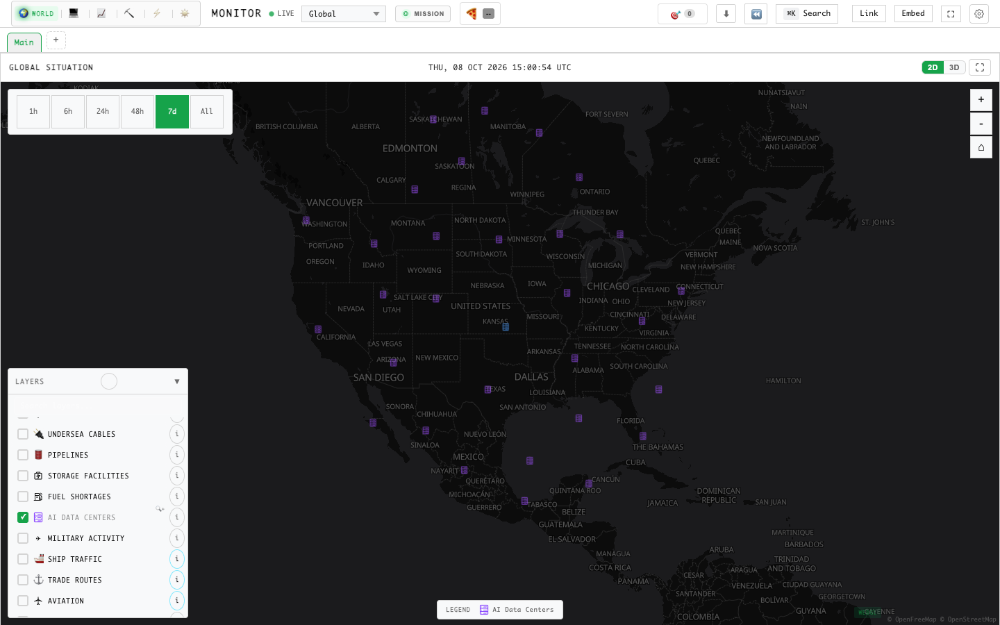

# World Monitor · 个人公开版

基于 [koala73/worldmonitor](https://github.com/koala73/worldmonitor) 的个人使用分支，
聚合公开新闻、地图图层和监测面板，提供免账号的全球态势看板。

本仓库：[hydavinci/world-monitor](https://github.com/hydavinci/world-monitor)。
这是独立修改版，不是上游官方网站、商业 API 或官方客户端下载渠道。



## 目录

- [项目定位](#项目定位)
- [主要功能](#主要功能)
- [快速启动](#快速启动)
- [配置与数据可用性](#配置与数据可用性)
- [工作区与地图](#工作区与地图)
- [报警通知](#报警通知)
- [开发与验证](#开发与验证)
- [项目结构](#项目结构)
- [已知限制](#已知限制)
- [上游与许可](#上游与许可)

## 项目定位

本分支保留公开数据看板和本地个性化配置，移除了账号、付费产品和推广入口：

| 保留 | 移除或停用 |
| --- | --- |
| 公开新闻、可用地图图层、监测面板 | 注册、登录、云端账号配置 |
| 本地面板、来源、主题、语言和工作区设置 | 订阅、结账、账单、付费专属面板 |
| Mission、变体切换、公开 AI 入口、直播与本地导出 | Pro 推广、官方客户端下载及更新提示 |
| 地图数据源署名、原始开源许可 | 页脚推广、版本和作者展示、Globe BETA 标签 |
| 页面报警、声音和桌面通知 | 依赖账号的外部通知订阅 |

客户端默认不再初始化上游的 Umami、Vercel Analytics、DebugBear 或 Sentry
遥测集成。访问地图、新闻和其他第三方数据源仍然需要网络，并不等于离线运行。

**“公开版”不意味着所有数据都无需凭据。** 部分公开数据提供商仍要求 API Key，
缓存服务、数据采集任务和 AI 服务也需要单独配置。原来的受保护接口不通过
添加账号凭据重新开放。

## 主要功能

| 功能 | 作用 |
| --- | --- |
| 全球地图 | 在 2D WebGL 地图和 3D 地球中浏览支持的地区、事件和基础设施图层 |
| 新闻聚合 | 汇集不同地区和主题的公开新闻来源，保留来源、时间和风险提示 |
| 国家与风险信息 | 展示可用的国家简报、公开风险信号和事件关联信息 |
| 基础设施监测 | 按可用数据展示数据中心、军事基地、核设施、港口、海缆等位置 |
| 专题面板 | 选择经济、市场、能源、灾害、航空、网络等公开监测内容 |
| 自定义工作区 | 保存独立的面板组合、排列和本地配置 |
| AI 辅助 | 使用已配置且可用的摘要与分析能力；不承诺所有 AI 功能均可无配置运行 |
| 报警通知 | 对符合现有规则的高危、严重突发事件显示横幅、声音及授权后的桌面通知 |
| 多语言与外观 | 调整界面语言、字体、页面主题和独立的地图底图主题 |

实际可选面板和图层以当前变体的界面为准；不同渲染器并不支持完全相同的图层。

## 快速启动

### 环境

- Node.js **24**，版本与 [`.nvmrc`](.nvmrc) 保持一致。
- npm。
- 建议使用支持 WebGL 的桌面浏览器；桌面通知需要浏览器和系统允许。
- 地图底图、新闻及实时数据需要联网。

### 克隆、安装和启动

```bash
git clone https://github.com/hydavinci/world-monitor.git
cd world-monitor

# 使用 nvm 时执行；未使用 nvm 时直接安装 Node.js 24
nvm install
nvm use

npm ci
npm run dev
```

打开 **http://localhost:3000**。停止服务时，在启动终端按 `Ctrl+C`。

`npm run dev` 启动 Vite 开发服务，开发插件处理支持的本地 RPC 请求，
其他请求按配置代理。这里不是旧版的 `5173` 前端加 `3001` 后端双进程方案，
通常不需要再单独启动一个 API 服务。

基础界面可在不创建 `.env.local` 的情况下启动，但没有配置或没有上游数据的面板
可能显示不可用、空数据或错误提示。界面能够启动不代表所有数据源都已经接通。

端口被占用时，可在 `.env.local` 中设置其他端口：

```dotenv
DEV_PORT=3002
```

重新启动后按终端输出的地址访问。`DEV_PORT` 不是 `VITE_` 变量。

### 其他变体

每次选择一个命令启动：

```bash
npm run dev:tech       # 科技、AI、云服务
npm run dev:finance    # 金融与市场
npm run dev:commodity  # 大宗商品
npm run dev:energy     # 能源
npm run dev:happy      # 正向新闻
```

这些变体共享源代码，但默认来源、面板和图层不同。它们不是本仓库已部署的在线站点。

## 配置与数据可用性

需要接入具体数据源时，从模板建立本地配置：

```bash
cp .env.example .env.local
```

只填写实际需要的变量，完整说明见 [`.env.example`](.env.example)。
例如 AI、缓存、市场和能源数据各有独立配置，不需要为了启动界面一次填完所有项。

注意：

- 不要提交 `.env.local`、真实密钥、环境变量备份、私有配置或运行日志。
- 不要将服务端密钥改成 `VITE_` 前缀；该前缀用于可以暴露给浏览器的配置。
- 本地 UI 设置主要存储在浏览器中；清除网站数据会影响工作区和个性化配置。
- 部分数据来自预先采集的缓存；仅启动 Vite 不会自动部署 Redis、采集任务或通知后台。
- 第三方接口可能存在额度、延迟、地区限制、CORS 限制和服务中断。

Docker、自托管和桌面构建的历史说明保留在 [SELF_HOSTING.md](SELF_HOSTING.md)、
[ARCHITECTURE.md](ARCHITECTURE.md) 和 `src-tauri/` 中。
这些说明继承自上游，可能包含本分支已经停用的功能；使用前应核对当前脚本和公开版边界。

## 工作区与地图

### Main 与自定义 Tab

**Main** 是默认的完整 Global Situation 地图工作区，不能删除。
新建 Tab 从空工作区开始，通过 **Add Panel** 添加需要的公开面板。
Add Panel 放在最后一行，不再补进前面的网格空隙。

工作区和面板配置保存在本地，不依赖账号同步。
历史配置里的已退休面板和图层会被过滤，不会因此清空无关的本地设置。

### 地图图标

- 普通位置和事件使用本地 SVG 分类图标，控件和图例尽量与当前渲染器对应。
- 核设施使用核辐射三叶标志；军事基地保留三角形及原有类别颜色。
- 2D 数据中心使用服务器机架图标；聚合图标固定为 **12px**，不随数量放大，
  地图上不显示数量徽标，点击详情仍保留数量。
- 2D 数据中心菜单和图例使用一致的紫色服务器图标；现有与规划状态的地图颜色保留。
- 原生单点和高亮大小、严重程度颜色、聚合逻辑以及点击详情按各图层原有语义保留。
- 其他数量聚合、密度点、热力图、影响范围、路径和航空方向标志不强制替换成同一种图标。
- 图层计数位于说明按钮左侧，说明按钮右对齐；加载和计数变化不再挤动控件。

3D 地球只显示其支持的图层，不承诺与 2D 完全等价。

### 页面主题与地图主题

页面的 Light Mode 和底图主题是独立设置。
如果页面变亮而地图仍暗，在 **Settings > Map Theme** 选择当前提供者支持的浅色主题，
例如 **Positron (light)**。

## 报警通知

当前提供三种页面打开期间的提醒：

| 方式 | 说明 |
| --- | --- |
| 页面横幅 | 展示符合筛选规则的突发事件，保留来源和查看面板入口 |
| 声音 | 沿用现有报警设置；可能受浏览器自动播放策略限制 |
| 系统桌面通知 | 获得授权并开启后，发送事件标题、严重级别和来源 |

开启桌面通知：

1. 打开 **Settings > Alert notifications（报警通知）**。
2. 保持“系统桌面通知”开关开启，点击 **Allow notifications（允许通知）**。
3. 在浏览器授权提示中允许通知。
4. 点击 **Send test notification（发送测试通知）** 检查效果。

点击事件通知会聚焦当前页面，并定位对应来源面板。通知沿用现有的事件筛选、
去重和冷却规则，不会为每条新闻都发出报警。

如果浏览器已阻止通知，需要在网站权限中重新允许；界面不会反复自动申请授权。
如果仍未出现通知，请检查系统通知设置和勿扰模式。
需要使用支持此功能的桌面浏览器，并通过 **HTTPS 或 localhost** 访问。

**网页必须保持打开。** 本分支没有为这项功能提供关闭网页后的后台推送，
也不包含 Telegram、邮件或短信发送服务。

## 开发与验证

常用命令：

```bash
npm run typecheck        # 前端 TypeScript
npm run typecheck:api    # API / 服务端 TypeScript
npm run test:dom         # DOM 行为回归
npm run test:data        # 数据及脚本测试
npm run lint:boundaries  # 模块边界
```

可只运行与修改相关的行为测试：

```bash
npm run test:dom -- \
  tests/dom/map-marker-pictograms.test.mts \
  tests/dom/map-layer-toggle-button-state.test.mts \
  tests/dom/desktop-alert-notifications.test.mts
```

浏览器用例位于 `e2e/`，覆盖工作区、地图图标、控件对齐和通知流程。
标准 Playwright 配置可能会自行启动测试服务；使用前应确认端口和配置，
不要与正在使用的本地调试服务混淆。

生产构建入口为 `npm run build`。它不只是打包前端，还包含上游继承的文档、
博客及生成步骤，可能安装子项目依赖或访问外部服务。
本 README 的本地启动流程不要求先执行完整生产构建。

桌面和 Docker 部署有额外的构建与服务依赖，不能仅凭浏览器运行成功认定其已验证。

Docker 保留两种明确不同的用途：

| 构建入口 | 用途 |
| --- | --- |
| 根目录 `Dockerfile` | 完整镜像，包含网页和本项目的本地 API；需要数据功能时采用这个方案 |
| `docker/Dockerfile` | 仅静态页面，不包含 API，也不代转官方 API；`/api` 和 `/api/` 下的请求返回明确的 `503 api_unavailable` |

静态镜像不再使用 `API_UPSTREAM` 或默认的官方 WebSocket 地址。
设置旧的 `API_UPSTREAM` 环境变量不会恢复代理；需要后端数据的面板在此模式下不可用。
以上是配置边界说明，不代表本分支已经完成容器镜像构建和运行验证。

## 项目结构

| 路径 | 内容 |
| --- | --- |
| `src/components/` | 地图、面板、工作区、设置和页面组件 |
| `src/services/` | 公开数据请求、本地配置、分析与通知 |
| `src/config/` | 面板、图层、数据源、变体和 SVG 图标定义 |
| `src/locales/` | 界面多语言资源 |
| `src/generated/`、`proto/` | 生成的 RPC 类型及协议定义 |
| `api/`、`server/` | API 入口、网关、服务端处理和公开版边界 |
| `scripts/` | 采集、生成、构建和检查脚本 |
| `src-tauri/` | 继承的桌面应用与 sidecar |
| `tests/`、`e2e/` | 单元、DOM 和浏览器测试 |
| `docs/` | 数据、架构和历史上游文档 |

前端使用 TypeScript、Vite、MapLibre GL、deck.gl、globe.gl 和 Three.js；
界面不是 React 项目。

## 已知限制

**当前发布为开发快照（2026-10-09）**，不是已完成全部清理和部署验收的稳定发行版。
完整数据测试、后端退休清理以及容器和实际运行验收仍有未完成项。

- **后端物理清理仍未完成**：公开版的页面入口和路由边界已调整，
  混合功能中的旧私有分支、历史测试和部分运维注册还在整理。
  不应把本仓库描述为“所有上游私有实现均已彻底删除”。
- **数据并非全部实时、完整或免费**：缓存可能滞后，上游来源可能缺失或被限流。
- **网页不是持续报警后台**：关闭页面、浏览器暂停标签页或系统限制通知时，
  不能保证继续获取事件或及时提醒。
- **部分历史文档和流水线仍继承上游假设**：尤其是官方商业 API、部署和桌面发布说明，
  不能视为本仓库提供相同服务的承诺。
- **不保证应急用途**：本项目用于个人信息观察和研究，不能替代官方预警、
  专业判断或其他可靠的应急渠道。

## 上游与许可

上游项目：[koala73/worldmonitor](https://github.com/koala73/worldmonitor)，
原始作者 **Elie Habib** 及上游贡献者。
本分支保留原始版权、开源许可及地图和数据源的署名，不代表上游官方产品。

源代码许可为 **AGPL-3.0-only**，完整条款见 [LICENSE](LICENSE)。
原始版权声明：Copyright (C) 2024-2026 Elie Habib。
第三方数据、瓦片和素材仍遵循各自的许可与使用条件。

贡献规范与安全反馈说明分别见 [CONTRIBUTING.md](CONTRIBUTING.md)、
[SECURITY.md](SECURITY.md)；其中与上游服务相关的流程需要按本仓库情况核对。
